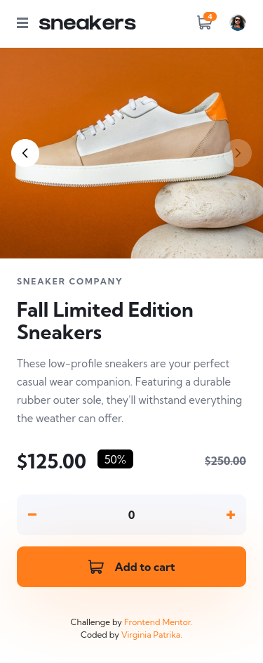
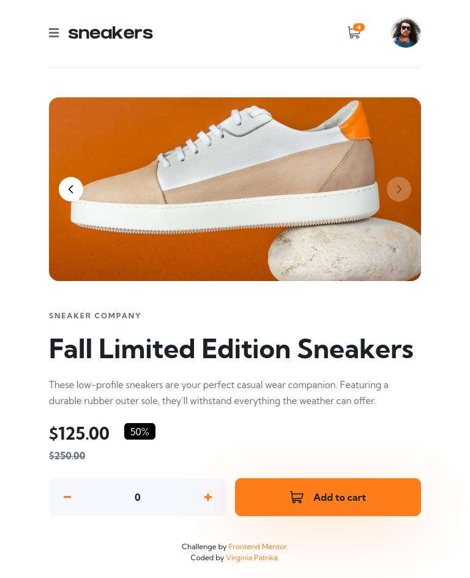
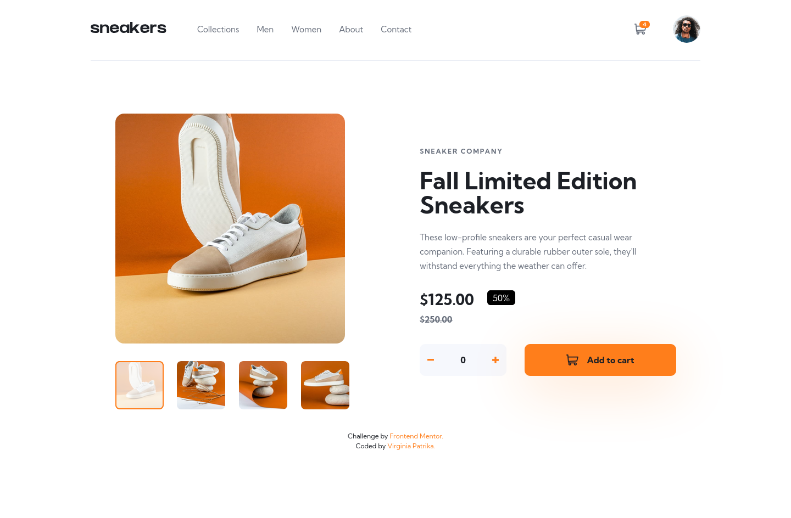

# Frontend Mentor - E-commerce product page solution

This is a solution to the [E-commerce product page challenge on Frontend Mentor](https://www.frontendmentor.io/challenges/ecommerce-product-page-UPsZ9MJp6). Frontend Mentor challenges help you improve your coding skills by building realistic projects.

## Table of contents

- [Overview](#overview)
  - [The challenge](#the-challenge)
  - [Screenshot](#screenshot)
  - [Links](#links)
- [My process](#my-process)
  - [Built with](#built-with)
- [Author](#author)

## Overview

### The challenge

Users should be able to:

- View the optimal layout for the site depending on their device's screen size
- See hover states for all interactive elements on the page
- Open a lightbox gallery by clicking on the large product image
- Switch the large product image by clicking on the small thumbnail images
- Add items to the cart
- View the cart and remove items from it

### Screenshot

### Links

- Solution URL: [Github](https://github.com/VirginiaPat/ecommerce-product-page.git)
- Live Site URL: [Netlify](https://ecommerce-product-virgi.netlify.app/)

## My process

I approached this challenge in three phases: HTML structure, CSS styling, and JavaScript interactivity.

I started by building semantic, accessible HTML — using correct heading hierarchy, ARIA attributes (`role="dialog"`, `aria-modal`, `aria-expanded`, `aria-hidden`, `aria-controls`), and landmark elements. I paid special attention to the carousel and lightbox patterns, following WAI-ARIA authoring practices.

For styling I used Tailwind CSS v4 with a mobile-first workflow, defining custom design tokens (colors, typography, breakpoints, filters) in `@theme`. I handled custom breakpoints for specific devices and used CSS filters to tint SVG icons.

For JavaScript I chose an ES Modules architecture with a shared `state.js` object, separating each component into its own module: `hamburger.js`, `carousel.js`, `lightbox.js`, `cart.js`, and a reusable `focusTrap.js` utility. The desktop carousel and lightbox share `state.currentImageIndex` so they stay in sync.

### Built with

- Semantic HTML5 markup
- CSS custom properties
- Tailwind
- Javascript
- Mobile-first

## What I learned

- **ES Modules architecture** — organising JavaScript into separate modules with a single entry point made the codebase much easier to maintain and debug. Passing `openLightbox` as a parameter from `index.js` to `initDesktopCarousel` helped me avoid circular dependencies between modules.

- **Focus management and accessibility** — implementing focus traps, the `inert` attribute, and returning focus to the triggering element taught me how keyboard navigation works in practice. I learned that `overflow-hidden` clips not just content but also focus outlines, which required a structural HTML solution.

- **Shared state** — using a single mutable `state` object imported across modules kept the desktop carousel and lightbox in sync without complex event systems.

## Continued development

- **localStorage for cart persistence** — currently the cart resets on page refresh. A natural next step would be to persist cart state to `localStorage` so items survive navigation.

## Author

- Frontend Mentor - [@VirginiaPat](https://www.frontendmentor.io/profile/VirginiaPat)
- GitHub - [VirginiaPat ](https://github.com/VirginiaPat)
- Netlify - [VirginiaPat](https://app.netlify.com/teams/virginia-patrika/sites)
